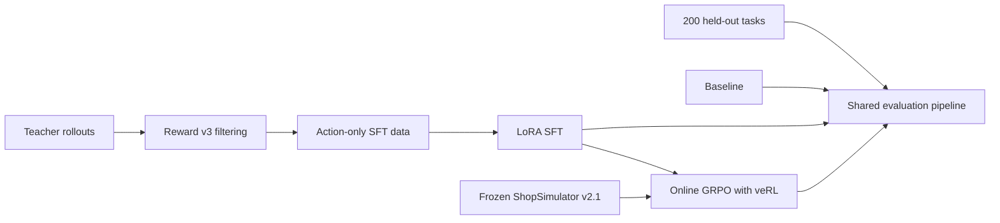
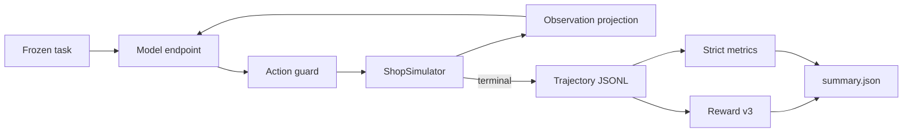

# Shopping GRPO

<div align="center">

**English** · [简体中文](README.md)

</div>

An end-to-end, beginner-oriented tutorial for post-training a shopping agent:

```text
Qwen3.5-2B baseline → LoRA SFT → GRPO with veRL → held-out evaluation
```

The repository ships one supported workflow, one environment contract and the
datasets needed to reproduce it. Clone it, follow the commands below in order,
and compare all three models on the same 200 held-out tasks.

## What is ShopSimulator?

[ShopSimulator](https://arxiv.org/pdf/2601.18225) is a large-scale Chinese
shopping environment for evaluating long-horizon LLM agents. A task describes
what a user wants—including category, budget, brand, model, functions and
product options—but the agent must discover the right item through interaction.

In this project the agent can search products, open candidates, inspect details,
select variants, buy, or stop when no acceptable item can be verified. Success
therefore requires more than producing a plausible answer: the agent must gather
evidence, obey constraints, choose the correct variant and terminate correctly.

The frozen Environment v2.1 source and product archive are embedded under
[`environments/ShopSimulator/`](environments/ShopSimulator/), so the tutorial
does not depend on a separately running third-party repository.

> **Reserved figure — Environment overview.** A Chinese shopping request on
> the left, the agent's Search → Inspect → Select → Buy interaction in the
> center, and ShopSimulator's product catalog and terminal reward on the right.

## The four stages

| Stage | What happens | Entry point | Details |
|---|---|---|---|
| Baseline | Evaluate the untouched base model | `bash scripts/baseline.sh` | [Evaluation](docs/evaluation.md) |
| SFT | Learn tool use from accepted teacher trajectories | `bash scripts/sft.sh` | [SFT](docs/sft.md) |
| GRPO | Optimize terminal Reward v3 with online rollouts | `bash scripts/grpo.sh` | [GRPO](docs/grpo.md) |
| Evaluation | Run the same frozen 200-task protocol | `bash scripts/evaluate.sh NAME` | [Evaluation](docs/evaluation.md) |

The checked-in SFT data was produced by a separate collection stage documented
in [Data collection](docs/data-collection.md). The custom constraint-aware
reward is specified in [Reward v3](docs/reward-v3.md).



### How the SFT data was collected

The final collection used `deepseek-v4-flash` as a teacher in ShopSimulator
Environment v2.1. Seven batches produced 604 unique raw trajectories. We
replayed and filtered them through Reward v3, kept 428 gold-purchase
trajectories, removed private reasoning and retained only observable actions.
The final split contains 379 training and 49 validation rows. Dataset hashes
and the complete audit are in [Data collection](docs/data-collection.md).

### How evaluation works

Every model is served through the same OpenAI-compatible endpoint and receives
the same 200 held-out tasks. The runner creates an isolated ShopSimulator
session, constrains actions to what was visible, projects observations into the
24,576-token context, records the full trajectory, and computes Reward v3 plus
strict-success metrics. Failed or missing tasks remain in the denominator.



> **Reserved figure — Training and evaluation pipeline.** A full-width diagram
> showing teacher data collection, LoRA SFT, online GRPO rollouts and the shared
> held-out evaluation path, with artifacts produced at each boundary.

## Results

One deterministic rollout per task on the same 200 held-out tasks:

| Model | Strict success | Purchase success | Mean reward |
|---|---:|---:|---:|
| Qwen3.5-2B baseline | 0.0% | 0.0% | -0.1105 |
| LoRA SFT | 60.5% | 60.5% | 0.4729 |
| GRPO step 100 | 62.0% | 62.5% | 0.5158 |

The complete compact summaries and reproduction settings are in
[`experiments/`](experiments/). These are reported results, not a promise that
different hardware or dependency versions will produce bit-identical training.

## Hardware, time and cost

The reported run used the following single-GPU setup. Cost is a rough
end-to-end estimate and should be replaced with the final provider invoice.

| Stage | Hardware | Time | Approximate cost |
|---|---|---:|---:|
| SFT | RTX 4090 48 GB | To be filled from the final log | Included below |
| GRPO | RTX 6000 96 GB | To be filled from the final log | Included below |
| Full workflow | Teacher API + GPU compute | Hardware/provider dependent | about USD 50 |

The 4090 was a 48 GB configuration rather than a standard retail 24 GB card.
The exact RTX 6000 model name, elapsed times and per-stage split are deliberately
left editable until the final billing and training logs are reconciled.

> **Reserved figure — Cost and training timeline.** A horizontal timeline for
> data collection, SFT, GRPO and final evaluation, annotated with GPU type,
> wall-clock hours and cost for each stage.

## Requirements

- Linux with an NVIDIA GPU and a compatible CUDA driver;
- [`uv`](https://docs.astral.sh/uv/);
- about 25 GB of free disk for environments, weights and generated artifacts;
- approximately 48 GB GPU memory for the provided SFT recipe;
- one 96 GB GPU for the provided GRPO recipe.

The main environment uses Python 3.12. ShopSimulator is isolated on Python 3.10.
`uv` creates both environments. veRL is **installed as the pinned
`verl==0.8.0` dependency**; its source is not copied into this repository. Only
the Shopping Agent adapter and a small version-checked patch live here.

## Quick start

Run every command from the repository root.

### 1. Install

```bash
bash scripts/setup.sh
```

This installs the pinned SFT and GRPO dependencies, creates the isolated
ShopSimulator environment, verifies and expands the product archive, builds the
search index and applies the version-checked veRL patch.

### 2. Start ShopSimulator

Keep this terminal running:

```bash
bash scripts/start_environment.sh
```

The service listens on `http://127.0.0.1:5700`.

### 3. Evaluate the baseline

Start the base model server in a second terminal:

```bash
bash scripts/serve_model.sh Qwen/Qwen3.5-2B
```

Evaluate it in a third terminal:

```bash
bash scripts/baseline.sh
```

Stop the model server before training so it releases the GPU.

### 4. Train and evaluate SFT

```bash
bash scripts/sft.sh
bash scripts/serve_model.sh outputs/models/sft-merged
bash scripts/evaluate.sh sft
```

Stop the model server again before GRPO.

### 5. Train GRPO

First inspect the fully resolved launcher without starting CUDA or Ray:

```bash
bash scripts/grpo.sh --dry-run
```

Then train:

```bash
bash scripts/grpo.sh
```

Choose a checkpoint using validation metrics and export its actor:

```bash
bash scripts/export_grpo.sh \
  outputs/models/grpo/global_step_100/actor \
  outputs/models/grpo-merged
```

Evaluate it:

```bash
bash scripts/serve_model.sh outputs/models/grpo-merged
bash scripts/evaluate.sh grpo
```

Generated checkpoints, rollouts and logs are written under `outputs/`, which is
ignored by Git.

## Repository map

```text
configs/                         current GRPO, AgentLoop and tool configuration
data/
  sft/                           379 train + 49 validation trajectories
  grpo/                          ready-to-train JSONL and veRL Parquet
  evaluation/                    frozen 200-task held-out set
docs/                            one guide for each tutorial stage and Reward v3
environments/ShopSimulator/      embedded environment and product archive
experiments/
  baseline/                      baseline config and result summary
  sft/                           SFT config and result summary
  grpo/                          GRPO config and result summary
scripts/                         thin user-facing tutorial entry points
src/shopping_grpo/
  environment/                   HTTP client, tools, actions and observations
  training/sft/                  SFT dataset masking and collation
  training/grpo/                 veRL adapter, compatibility and sampling logic
  evaluation/                    rollout normalization and metric aggregation
tests/                           focused unit, launcher and packaging checks
```

The project keeps focused checks for the CPU smoke path, offline trajectory
evaluation, GRPO launcher arguments, non-editable wheel installation, Reward
aggregation and the frozen environment manifest. Cleanup does not mean deleting
tests that protect the public workflow.

## Configuration

Most users only need these environment variables:

| Variable | Default |
|---|---|
| `BASE_MODEL` | `Qwen/Qwen3.5-2B` |
| `SHOPSIM_BASE_URL` | `http://127.0.0.1:5700` |
| `LLM_BASE_URL` | `http://127.0.0.1:8000/v1` |
| `SERVED_MODEL_NAME` | `shopping-agent` |
| `SFT_ADAPTER_DIR` | `outputs/models/sft-lora` |
| `SFT_MERGED_DIR` | `outputs/models/sft-merged` |

Advanced GRPO overrides can be appended after `--`:

```bash
bash scripts/grpo.sh -- \
  trainer.total_training_steps=20 \
  trainer.save_freq=10
```

SwanLab logging is opt-in:

```bash
export SWANLAB_API_KEY=...
bash scripts/grpo.sh --logger swanlab
```

## Documentation

- [Data collection and dataset provenance](docs/data-collection.md)
- [LoRA SFT](docs/sft.md)
- [GRPO with veRL](docs/grpo.md)
- [Held-out evaluation](docs/evaluation.md)
- [Reward v3 design](docs/reward-v3.md)
- [Auditable experiment results](experiments/comparison.md)

## References and acknowledgements

This tutorial builds on the
[ShopSimulator paper](https://arxiv.org/pdf/2601.18225) and source project,
[veRL](https://github.com/verl-project/verl), and
[Qwen](https://github.com/QwenLM/Qwen3).

The repository organization and tutorial presentation were informed by
[qiqihezh/agentic-grpo-longhorizon](https://github.com/qiqihezh/agentic-grpo-longhorizon).
Thanks to the [OpenCode Go plan](https://dev.opencode.ai/go) for supporting the
development workflow.
