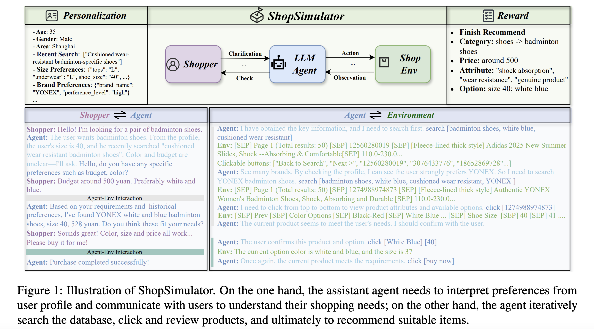
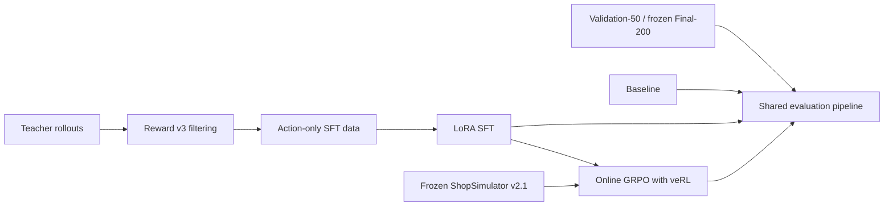
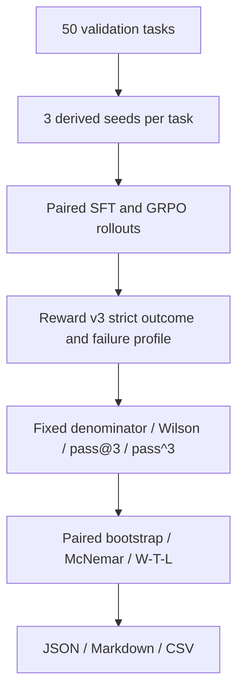

# Shopping GRPO

<div align="center">

**English** · [简体中文](README.md)

<br />

Reproducible post-training and evaluation for long-horizon shopping agents

<br />

[](pyproject.toml)
[](docs/sft.md)
[](https://github.com/verl-project/verl)
[](https://arxiv.org/pdf/2601.18225)
[](experiments/validation-50x3/README.md)

<br />

Teacher rollouts and LoRA SFT → online GRPO with veRL → paired repeated sampling
and statistical tests

</div>


## Current result

The current branch evaluates SFT and Terminal-GRPO (30 updates) on 50 development
tasks from `data/grpo/validation.jsonl`, with three paired attempts per task.
Both models use the same task, attempt, derived seed, and
`temperature/top-p=0.7/0.9`; strict success has a fixed denominator of 150
attempts per model.

| Model | Strict success | Wilson 95% CI | Win/tie/loss vs SFT | `pass@3` | `pass^3` | Loop rate | Mean steps |
|---|---:|---:|---:|---:|---:|---:|---:|
| SFT | 66.7% | [58.8%, 73.7%] | — | 78.0% | 54.0% | 10.0% | 10.95 |
| Terminal-GRPO (30 updates) | **74.7%** | **[67.2%, 81.0%]** | **9/39/2** | **84.0%** | **62.0%** | **8.7%** | **10.80** |

The paired difference is **+8.0 percentage points**. A 10,000-sample task-paired
bootstrap gives a 95% CI of **[+2.0, +14.7] points**, and the exact McNemar test
gives `p=0.0118`. Both runs have 100% attempt coverage, zero infrastructure-invalid
attempts, and zero critical footer failures. See the
[Validation-50×3 experiment card](experiments/validation-50x3/README.md) for
configuration, hashes, and limitations.

> This is a development-set method comparison, not a Final-200 score. It must
> not be subtracted directly from the upstream single-pass 60.5%/62.0% results;
> Final-200 remains frozen and is not used for tuning.

## Contributions and result ownership

| Upgrade | Implementation |
|---|---|
| Repeated sampling | task/attempt-derived seeds, fixed denominators, resumable collection; local seed replay matched 10/10 |
| Statistical tests | Wilson CI, `pass@k` / `pass^k`, task-paired bootstrap, exact McNemar, win/tie/loss |
| Stratified diagnostics | constraint, option, price, and reference-length strata derived only from Query fields |
| Failure audit | separate infrastructure, Reward validity, Guard, footer, loop, termination, and context errors |
| Reproducibility | JSON/Markdown/CSV reports, model/data/config SHA-256, deterministic training seeds, explicit checkpoint resume |

This repository continues the commit history of
[YYHDBL/shopping-grpo-longhorizon](https://github.com/YYHDBL/shopping-grpo-longhorizon).
The imported 200-task results, runtime, and memory figures are labelled separately
below and are not new measurements from this branch. No license file was present
in the imported repository; read [NOTICE](NOTICE.md) and confirm the upstream
terms before redistribution or portfolio use.

## What is ShopSimulator?

[ShopSimulator](https://arxiv.org/pdf/2601.18225) is a large-scale Chinese
shopping environment for evaluating long-horizon LLM agents. A task describes
what a user wants—including category, budget, brand, model, functions and
product options—but the agent must discover the right item through interaction.

In this project the agent can search products, open candidates, inspect details,
select variants, buy, or stop when no acceptable item can be verified. Success
therefore requires more than producing a plausible answer: the agent must gather
evidence, obey constraints, choose the correct variant and terminate correctly.

The frozen Environment v2.1 source and product archive are embedded under
[`environments/ShopSimulator/`](environments/ShopSimulator/), so the tutorial
does not depend on a separately running third-party repository.



## The four stages

| Stage | What happens | Entry point | Details |
|---|---|---|---|
| Baseline | Evaluate the untouched base model | `bash scripts/baseline.sh` | [Evaluation](docs/evaluation.md) |
| SFT | Learn tool use from accepted teacher trajectories | `bash scripts/sft.sh` | [SFT](docs/sft.md) |
| GRPO | Optimize terminal Reward v3 with online rollouts | `bash scripts/grpo.sh` | [GRPO](docs/grpo.md) |
| Evaluation | Use one strict-success contract for repeated validation and frozen Final-200 | `bash scripts/evaluate.sh NAME` | [Evaluation](docs/evaluation.md) |

The checked-in SFT data was produced by a separate collection stage documented
in [Data collection](docs/data-collection.md). The custom constraint-aware
reward is specified in [Reward v3](docs/reward-v3.md).



### How the SFT data was collected

The final collection used `deepseek-v4-flash` as a teacher in ShopSimulator
Environment v2.1. Seven batches produced 604 unique raw trajectories. We
executed every trajectory in the environment and accepted it from its Reward v3
terminal result, kept 428 gold-purchase trajectories, removed private reasoning
and retained only observable actions.
The final split contains 379 training and 49 validation rows. Dataset hashes
and the complete audit are in [Data collection](docs/data-collection.md).

The resumable collection entry point is:

```bash
python scripts/collect_sft_data.py \
  --tasks data/grpo/train.jsonl \
  --output-dir outputs/sft-collection \
  --target-accepted 428 \
  --workers 4
```

### How GRPO is trained

GRPO starts from the merged SFT model. veRL generates four online trajectories
per prompt in ShopSimulator, while deterministic Reward v3 scores the terminal
purchase, constraint satisfaction and termination behavior. No additional
LLM-as-a-Judge reward model is used for training.

The repository pins `verl==0.8.0` instead of copying its source. It keeps only
the project-specific AgentLoop, tool adapter, runtime compatibility code and a
small SHA-256-checked patch. See the [GRPO guide](docs/grpo.md) for details.

### How evaluation works

The primary evaluator on this branch replays real Actor interactions in
ShopSimulator and uses deterministic Reward v3 for terminal outcomes. Strict
success requires a complete `gold_purchase` with `reward_valid=true`; missing
rows, task errors, Guard rejections, and infrastructure failures remain in the
fixed denominator.



Constraint, option, price, and reference-length strata use only public Query or
metadata fields—never a Gold ASIN or target-product field. Search-step and
trajectory-length buckets are model-conditional behavioral diagnostics, not
causal explanations.

The repository retains the upstream offline Rubric Curator and Trajectory Judge
modules and static dashboard, but the public entry point does not rerun that
complete Judge pipeline in one command. They are therefore not evidence for the
new result on this branch. See the [evaluation guide](docs/evaluation.md) for
the imported protocol and input-isolation rules.

## Upstream reported results

One deterministic rollout per task on the same 200 held-out tasks:

| Model | Strict success | Purchase success | Mean reward |
|---|---:|---:|---:|
| Qwen3.5-2B baseline | 0.0% | 0.0% | -0.1105 |
| LoRA SFT | 60.5% | 60.5% | 0.4729 |
| GRPO step 100 | 62.0% | 62.5% | 0.5158 |

The complete compact summaries and reproduction settings are in
[`experiments/`](experiments/). These are reported results, not a promise that
different hardware or dependency versions will produce bit-identical training.

GRPO improves over SFT by only 3/200 strict-success tasks (+1.5 percentage
points), with one rollout per task, so this table alone does not establish a
statistically significant gain. The repeated-run evaluator now reports a fixed
attempt denominator, Wilson 95% intervals, empirical `pass@k` / `pass^k`, a
task-paired bootstrap interval, and an exact McNemar test. The development-set
result above is the first complete rerun under that protocol. It uses a different
task set, checkpoint, and sampling design from the upstream single-pass Final-200
table, so the two tables must not be subtracted directly.

## Upstream reported training hardware and time

The upstream record used one NVIDIA RTX 6000 with 96 GB of GPU memory. This
branch has not remeasured the figures.

### LoRA SFT training (379 training examples, 3 epochs)

| Stage | Time | Peak GPU memory |
|---|---:|---:|
| One epoch (47 steps) | ~62 min | 89 GiB |
| Full 3-epoch training | ~3 h | 89 GiB |

### GRPO training (veRL 0.8, 8 environment workers)

| Step range | Per-step time | Cumulative time |
|---|---:|---:|
| steps 0–24 | ~140 s/step, including Ray startup | ~56 min |
| stable steps 20–30 | ~73–120 s/step | ~2 min/step in the steady state |
| 100 steps (reported checkpoint) | ~110 s/step on average | ~3–4 h |
| Full 500 steps | ~100 s/step | ~14 h |

### Other stages

| Stage | Estimated time |
|---|---:|
| Teacher collection (604 trajectories × 7 batches) | ~7–14 h |
| 200-task evaluation (Base) | ~20 min |
| 200-task evaluation (SFT/GRPO) | ~40–60 min |
| LLM Judge scoring for 200 trajectories | ~30–60 min |

## Requirements

- Linux with an NVIDIA GPU and a compatible CUDA driver;
- [`uv`](https://docs.astral.sh/uv/);
- about 25 GB of free disk for environments, weights and generated artifacts;
- 96 GB GPU memory for the measured SFT recipe (89 GiB peak); a 48 GB recipe has
  not been validated;
- one 96 GB GPU for the provided GRPO recipe.

The main environment uses Python 3.12. ShopSimulator is isolated on Python 3.10.
`uv` creates both environments. veRL is **installed as the pinned
`verl==0.8.0` dependency**; its source is not copied into this repository. Only
the Shopping Agent adapter and a small version-checked patch live here.

See [the statistical evaluation upgrade](docs/local-upgrades.md) for metric and
stratification definitions, and the [96 GB GPU runbook](docs/gpu-runbook.md) for
the matched SFT-vs-GRPO execution protocol and stop rules.

## Quick start

Run every command from the repository root.

### 1. Install

```bash
bash scripts/setup.sh
```

This installs the pinned SFT and GRPO dependencies, creates the isolated
ShopSimulator environment, verifies and expands the product archive, builds the
search index and applies the version-checked veRL patch.

### 2. Start ShopSimulator

Keep this terminal running:

```bash
bash scripts/start_environment.sh
```

The service listens on `http://127.0.0.1:5700`.

### 3. Evaluate the baseline

Start the base model server in a second terminal:

```bash
bash scripts/serve_model.sh Qwen/Qwen3.5-2B
```

Evaluate it in a third terminal:

```bash
bash scripts/baseline.sh
```

Stop the model server before training so it releases the GPU.

### 4. Train and evaluate SFT

```bash
bash scripts/sft.sh
bash scripts/serve_model.sh outputs/models/sft-merged
bash scripts/evaluate.sh sft
```

Stop the model server again before GRPO.

### 5. Train GRPO

First inspect the fully resolved launcher without starting CUDA or Ray:

```bash
bash scripts/grpo.sh --dry-run
```

Then train:

```bash
bash scripts/grpo.sh
```

Choose a checkpoint using validation metrics and export its actor:

```bash
bash scripts/export_grpo.sh \
  outputs/models/grpo/global_step_100/actor \
  outputs/models/grpo-merged
```

Evaluate it:

```bash
bash scripts/serve_model.sh outputs/models/grpo-merged
bash scripts/evaluate.sh grpo
```

Generated checkpoints, rollouts and logs are written under `outputs/`, which is
ignored by Git.

### 6. Generate the paired statistics report

See the [GPU runbook](docs/gpu-runbook.md) for repeated SFT and GRPO rollout
collection. Once both JSONL files exist, create the machine-readable comparison
and presentation tables with one command:

```bash
python scripts/compare_repeated_evaluations.py \
  --benchmark data/grpo/validation.jsonl --limit 50 \
  --baseline outputs/eval/sft-50x3/raw.jsonl \
  --candidate outputs/eval/terminal-grpo-50x3/raw.jsonl \
  --attempts-per-task 3 --bootstrap-samples 10000 --seed 2026 \
  --baseline-label SFT --candidate-label Terminal-GRPO \
  --output outputs/eval/sft-vs-terminal-50x3/comparison.json \
  --markdown-output outputs/eval/sft-vs-terminal-50x3/report.md \
  --csv-output outputs/eval/sft-vs-terminal-50x3/report.csv
```

## Reward V3 overview

Reward v3 is a deterministic terminal reward; it does not rely on another
language model for subjective judgment:

- category and budget are hard gates;
- brand, model, core functions and key options use weights of
  `0.35 / 0.25 / 0.25 / 0.15`;
- an exact target purchase with full satisfaction receives `1.0`;
- a fully satisfying alternative item receives `0.55`;
- partial satisfaction receives a continuous score capped at `0.25`;
- wrong purchases, premature abstention, repeat loops and maximum-step
  termination receive distinct negative rewards;
- insufficient evidence sets `reward_valid=false`, rather than being treated as
  a valid neutral zero.


The complete formula, termination rules and evidence requirements are in the
[Reward v3 design guide](docs/reward-v3.md).

## Repository map

```text
configs/                         current GRPO, AgentLoop and tool configuration
data/
  sft/                           379 train + 49 validation trajectories
  grpo/                          ready-to-train JSONL and veRL Parquet
  evaluation/                    frozen 200-task held-out set
docs/                            one guide for each tutorial stage and Reward v3
environments/ShopSimulator/      embedded environment and product archive
experiments/
  validation-50x3/               current paired evaluation card and hashes
  baseline/                      baseline config and result summary
  sft/                           SFT config and result summary
  grpo/                          GRPO config and result summary
scripts/                         thin user-facing tutorial entry points
src/shopping_grpo/
  collection/                    Teacher acceptance and SFT data construction
  environment/                   HTTP client, tools, actions and observations
  training/sft/                  SFT dataset masking and collation
  training/grpo/                 veRL adapter, compatibility and sampling logic
  evaluation/                    repeated sampling, paired statistics, strata, and imported Judge modules
tests/                           focused unit, launcher and packaging checks
```

The project keeps focused checks for the CPU smoke path, offline trajectory
evaluation, GRPO launcher arguments, non-editable wheel installation, Reward
aggregation and the frozen environment manifest. Cleanup does not mean deleting
tests that protect the public workflow.

## Configuration

Most users only need these environment variables:

| Variable | Default |
|---|---|
| `BASE_MODEL` | `Qwen/Qwen3.5-2B` |
| `SHOPSIM_BASE_URL` | `http://127.0.0.1:5700` |
| `LLM_BASE_URL` | `http://127.0.0.1:8000/v1` |
| `SERVED_MODEL_NAME` | `shopping-agent` |
| `SFT_ADAPTER_DIR` | `outputs/models/sft-lora` |
| `SFT_MERGED_DIR` | `outputs/models/sft-merged` |

Advanced GRPO overrides can be appended after `--`:

```bash
bash scripts/grpo.sh -- \
  trainer.total_training_steps=20 \
  trainer.save_freq=10
```

SwanLab logging is opt-in:

```bash
export SWANLAB_API_KEY=...
bash scripts/grpo.sh --logger swanlab
```

## Documentation

- [Data collection and dataset provenance](docs/data-collection.md)
- [LoRA SFT](docs/sft.md)
- [GRPO with veRL](docs/grpo.md)
- [Held-out evaluation](docs/evaluation.md)
- [Statistical evaluation upgrade](docs/local-upgrades.md)
- [50×3 GPU runbook](docs/gpu-runbook.md)
- [Current Validation-50×3 experiment card](experiments/validation-50x3/README.md)
- [Final-200 Benchmark Dashboard](docs/evaluation-dashboard.html)
- [Reward v3 design](docs/reward-v3.md)
- [Auditable experiment results](experiments/comparison.md)

## References and acknowledgements

This repository is a derivative of
[YYHDBL/shopping-grpo-longhorizon](https://github.com/YYHDBL/shopping-grpo-longhorizon)
and builds on the
[ShopSimulator paper](https://arxiv.org/pdf/2601.18225) and source project,
[veRL](https://github.com/verl-project/verl), and
[Qwen](https://github.com/QwenLM/Qwen3).

The evaluation protocol and Benchmark construction were also informed by
[VitaBench: Benchmarking LLM Agents with Versatile Interactive Tasks in Real-world Applications](https://arxiv.org/pdf/2509.26490)
and
[EComAgentBench: Benchmarking Shopping Agents on Long-Horizon Tasks with Distributed Hidden Intent](https://arxiv.org/pdf/2606.17698).

The repository organization and tutorial presentation were informed by
[qiqihezh/agentic-grpo-longhorizon](https://github.com/qiqihezh/agentic-grpo-longhorizon).
Thanks to the [OpenCode Go plan](https://dev.opencode.ai/go) for supporting the
development workflow.
