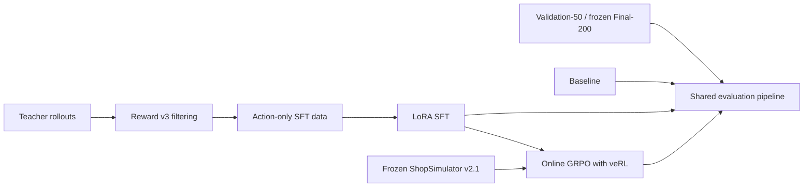
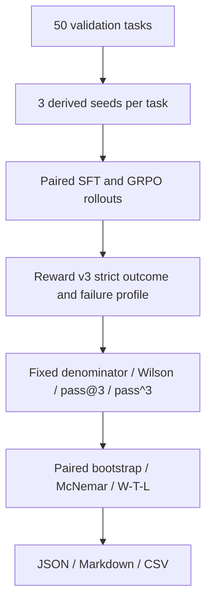

# Shopping GRPO

<div align="center">

**English** · [简体中文](README.md)

<br />

Reproducible post-training and evaluation for long-horizon shopping agents

<br />

[](pyproject.toml)
[](docs/sft.md)
[](https://github.com/verl-project/verl)
[](https://arxiv.org/pdf/2601.18225)
[](experiments/final-200/README.md)

<br />

Teacher rollouts and LoRA SFT → online GRPO with veRL → paired repeated sampling
and statistical tests

</div>


## Project scope and evidence boundary

This project builds on the public capabilities of Qwen, veRL, and
ShopSimulator; it does not claim original authorship of the foundation model,
training framework, or simulator. Repository-owned upgrades focus on
long-horizon trajectory acceptance, online-GRPO integration, checkpoint
recovery, paired repeated evaluation, frozen confirmation, and budget-aware
mechanism diagnosis. The upgrade scope is anchored at the fixed baseline
`d99a0ac` and audited with `git diff d99a0ac..HEAD`; see the
[upgrade and evidence map](docs/local-upgrades.md).

The strongest supported conclusion is that SFT establishes most of the agent
capability, while the positive GRPO development signal did not become a
reliable frozen-confirmation gain. More-SFT, the Reward-v4 audit, and the
active-set pilot diagnose that gap and control GPU cost; they are not promoted
as unverified algorithmic improvements.

## Complete experimental results

The project progressed through three consecutive stages: establishing the
Baseline/SFT/GRPO pipeline, adding statistical evaluation, and confirming the
selected method on a frozen confirmation set. The table keeps each checkpoint and
protocol explicit so absolute rates are not compared across protocols.

| Stage | Model and protocol | Strict success | vs stage-matched SFT | Statistical conclusion |
|---|---|---:|---:|---|
| Pipeline benchmark, Final-200×1 | Qwen3.5-2B Base | 0/200 = 0.0% | — | One deterministic rollout |
| Pipeline benchmark, Final-200×1 | LoRA SFT | 121/200 = 60.5% | — | One deterministic rollout |
| Pipeline benchmark, Final-200×1 | GRPO step 100 | 124/200 = 62.0% | +1.5 points | One pass; sampling variance not estimated |
| Method selection, Validation-50×3 | SFT | 100/150 = 66.7% | — | Wilson 95% CI [58.8%, 73.7%] |
| Method selection, Validation-50×3 | Terminal-GRPO 30 | 112/150 = **74.7%** | **+8.0 points** | paired CI [+2.0,+14.7], `p=0.0118` |
| Frozen confirmation, Final-200×1 | SFT | 114/200 = 57.0% | — | Wilson 95% CI [50.1%, 63.7%] |
| Frozen confirmation, Final-200×1 | Terminal-GRPO 30 | 117/200 = **58.5%** | +1.5 points | paired CI [-2.0,+5.0], `p=0.6072` |

Before the final row pair, the commit, models, configuration, and data hashes
were frozen. Strict success used all 200 tasks as the denominator, and the
frozen-stage decision was not revised or rerun after its results became visible.
Both models had 100% coverage, zero infrastructure-invalid attempts, zero
critical footer failures, and a win/tie/loss count of 9/185/6. The +8.0-point
validation effect did not reproduce on Final-200. The final conclusion is
therefore: **SFT establishes
most of the agent capability; GRPO shows a small positive signal, but the
current evidence does not establish a reliable final improvement.** See the
[experiment comparison](experiments/comparison.md),
[Validation-50×3 card](experiments/validation-50x3/README.md), and
[Final-200 card](experiments/final-200/README.md).

Final-200 has zero overlap with training data, but the same 200 tasks were used
in the project's earlier pipeline benchmark. The later freeze therefore means
that no tuning followed that stage's result; it is a frozen recheck rather than
the project's first blind look at a pristine test set.

The pipeline benchmark and frozen confirmation used different SFT/GRPO
checkpoints and code snapshots. They are stages of one project, but differences
between their absolute success rates are not training-effect estimates.

### Single-seed mechanism ablation (development set)

An additional low-cost `seed=42` experiment evaluated four SFT configurations
on the same Validation-50×3 protocol, with temperature/top-p `0.7/0.9` and a
fixed denominator of 150 attempts:

| Configuration | Strict success | Wilson 95% CI | `pass@3` | `pass^3` |
|---|---:|---:|---:|---:|
| 95 trajectories, 144 steps | 93/150 = 62.0% | [54.0%, 69.4%] | 74.0% | 46.0% |
| 190 trajectories, 144 steps | 99/150 = 66.0% | [58.1%, 73.1%] | 82.0% | 48.0% |
| 379 trajectories, 144 steps | 100/150 = 66.7% | [58.8%, 73.7%] | 80.0% | 56.0% |
| 379 trajectories, 288 steps | 105/150 = **70.0%** | [62.2%, 76.8%] | **84.0%** | **58.0%** |

The point estimates are consistent with possible benefits from data diversity
and additional SFT compute, but neither key paired interval excludes zero:
`95→379@144` is +4.7 points with CI [-4.7,+14.0], and
`379@144→379@288` is +3.3 points with CI [-2.7,+10.0]. These are not claims of
statistically reliable gains.

Put directly: **doubling SFT from 144 to 288 steps raised the development-set
point estimate by 3.3 points and reduced loops from 18.0% to 4.7%.** That point
estimate exceeds the +1.5-point frozen Final-200 GRPO estimate, but the protocols
differ and do not establish that SFT outperforms GRPO. Under the same
Validation-50×3 protocol, Terminal-GRPO gained +8.0 points, more than the
+3.3-point More-SFT gain. The defensible conclusion is that additional SFT is a
cheap, competitive control that can explain or exceed a small GRPO gain, so RL
claims should not omit a More-SFT control.

The later **post-hoc Final-200×3** stochastic evaluation measured
Terminal-GRPO-30 at 379/600 = 63.2% and More-SFT at 394/600 = 65.7%. More-SFT
was +2.5 points, with `pass@3/pass^3` 76.0%/55.5% versus 74.0%/53.0%, and loop
rate 9.0% versus 11.2%. Task win/tie/loss was `32/146/22`, paired CI
[-1.2,+6.2] points, and McNemar `p=0.1756`. This makes More-SFT a competitive
practical checkpoint, but not a proven causal winner: the benchmark was reused
after prior results were known and the checkpoints are not a matched same-
initialization, same-compute training pair.

The ASIN-neutral Reward v4 audit replayed 700 existing trajectories. Reward v3
had 443 strict successes and v4 had 444 constraint-complete successes; the
scalar optimization reward also changed on only one trajectory, with zero
target-ASIN invariance failures.
The project therefore completed only five-effective-update v3/v4 integration
smokes and checkpoint-resume validation; it did not complete a matched
100-update comparison and **does not claim a Reward v4 algorithmic gain**. See
the [single-seed mechanism card](experiments/single-seed-42/README.md).

A final low-cost pilot targeted terminal-GRPO sampling waste. More-SFT first
sampled 48 difficult training tasks four times; the 20 tasks with varying valid
Reward v3 outcomes formed a ten-update active set. The effective-group ratio
reached 71.7% and all 10 updates were applied, but matched Validation-50×3 moved
only from 70.0% to 71.3% (+1.3 points; bootstrap 95% CI [-5.3,+8.0], McNemar
`p=0.8238`), with unchanged `pass@3` and `pass^3`. The pilot observed a higher
effective-group ratio, but different initializations and run lengths prevent a
causal attribution to active screening. It did **not** establish a GRPO gain over
More-SFT. The run failed its promotion gate, so training stopped and Final-200
was not run.

### Overall experimental analysis

1. **SFT is the main source of capability.** In the initial pipeline,
   Base→SFT moves strict success from 0.0% to 60.5% and valid termination from
   18.0% to 96.5%. It primarily teaches the action protocol, long-horizon tool
   use, and termination—not merely product knowledge.
2. **The GRPO development gain is unstable.** Terminal-GRPO-30 gains 8.0 points
   on Validation-50×3 with a positive interval, but only 1.5 points with an
   interval crossing zero in frozen confirmation.
3. **More-SFT is a required low-cost control.** It reaches 70.0% on development
   and 65.7% in post-hoc Final-200×3, with better loop, Guard, and step metrics
   than Terminal-GRPO in that repeated run. The point estimates are still not
   significant and do not form a same-initialization, same-compute causal pair.
4. **The demonstrated issue is insufficient within-group terminal-reward
   variance.** The active-set pilot observed 71.7% effective groups without
   changing `pass@3` or `pass^3`. Turn-level credit assignment remains a
   plausible hypothesis, not a bottleneck established by this experiment.
5. **The strongest contribution is the experimental loop.** The project
   demonstrates usable SFT, online and resumable GRPO, strict rewards, paired
   statistics, and failure auditing, while retaining negative results for
   methods that fail confirmation or promotion gates.

## Core implementation and experimental upgrades

| Upgrade | Implementation |
|---|---|
| Repeated sampling | task/attempt-derived seeds, fixed denominators, resumable collection; local seed replay matched 10/10 |
| Statistical tests | Wilson CI, `pass@k` / `pass^k`, task-paired bootstrap, exact McNemar, win/tie/loss |
| Stratified diagnostics | constraint, option, price, and reference-length strata derived only from Query fields |
| Failure audit | separate infrastructure, Reward validity, Guard, footer, loop, termination, and context errors |
| Mechanism stop rule | audit Reward v4 signal on 700 trajectories first; stop costly long training when only one sample differentiates it, and never treat smoke as performance evidence |
| Effective-group screening | pre-screen repeated Reward v3 rollouts for within-group variance; the ten-update pilot observed 71.7% effective groups, without a controlled uniform-sampling attribution, and gained only +1.3 points on development |
| Final freeze | pre-frozen commit, model, checkpoint, configuration, validation-report, and Final-200 hashes; one frozen-confirmation run only |
| Reproducibility | JSON/Markdown/CSV reports, model/data/config SHA-256, deterministic training seeds, explicit checkpoint resume, and periodic saves |

## Five questions an Agentic RL project must answer

These answers map directly to implemented code and auditable artifacts. They
are also the canonical way to describe this project.

| Question | Answer in this project | Evidence |
|---|---|---|
| Task environment | ShopSimulator Environment v2.1. Each Chinese Query may specify category, budget, brand/model, functions, and product options. The agent operates a stateful shopping page only through incremental Observations and must buy or stop within 35 steps. | [Environment source](environments/ShopSimulator/) · [Evaluation protocol](docs/evaluation.md) |
| Action space | The public schema contains 13 serial tools. Twelve effective environment actions cover search, product opening, option selection, four evidence views, pagination/navigation, purchase, and abstention. `think` has no environment effect and is explicitly discouraged. Arguments must be grounded in the current Observation; the Guard rejects illegal or stale actions. | [Tool definitions](src/shopping_grpo/environment/tools.py) |
| Training trajectories | A trajectory is `Query → tool call → Observation → … → terminal`. SFT retained 428 strict-success trajectories from 604 executed teacher rollouts, used a 379/49 train/validation split, and applies loss only to Assistant action tokens. GRPO starts from merged SFT and samples four fresh environment trajectories per prompt online. | [Data collection](docs/data-collection.md) · [SFT](docs/sft.md) · [GRPO](docs/grpo.md) |
| Reward design | Reward v3 is a deterministic terminal reward without an LLM judge. It first gates category and budget, then scores active preferences with brand 0.35, model 0.25, core functions 0.25, and key options 0.15, while distinguishing exact, valid-alternative, partial, abstention, loop, and wrong-purchase outcomes. The Actor sees only Query and Observation; Gold ASIN and target-product fields are used only for terminal scoring. An adapter-only ASIN-neutral v4 was also implemented, but its offline audit found too little additional signal for promotion to the project reward. | [Reward v3 specification](docs/reward-v3.md) · [Mechanism card](experiments/single-seed-42/README.md) |
| Evaluation loop | Paired-seed Validation-50×3 is used for selection and reports a fixed denominator, Wilson intervals, `pass@3`/`pass^3`, paired bootstrap, McNemar, win/tie/loss, and failure profiles. Code, models, configuration, and hashes are then frozen for one deterministic frozen-stage Final-200 run, with no revision of that decision after its result. Later repeated runs are explicitly labeled post-hoc. | [Validation card](experiments/validation-50x3/README.md) · [Final-200 card](experiments/final-200/README.md) |

The twelve effective actions are `search_products`, `open_product`,
`select_option`, `view_description`, `view_features`, `view_reviews`,
`view_attributes`, `next_page`, `prev_page`, `back_to_search`, `buy_now`, and
`finish_without_purchase`. At most one action executes per turn, so every
action, Observation, and reward remains attributable to a specific trajectory
position.

The closed-loop conclusion is not that GRPO has already demonstrated a
significant gain. Its +8.0-point validation improvement did not generalize to
Final-200, where the observed gain was +1.5 points with an interval crossing
zero. The strongest contribution at this stage is a reproducible connection
between agent training, strict terminal scoring, paired statistics, and failure
auditing—and the honest rejection of an algorithmic hypothesis that did not
survive frozen confirmation.

## What is ShopSimulator?

[ShopSimulator](https://arxiv.org/pdf/2601.18225) is a large-scale Chinese
shopping environment for evaluating long-horizon LLM agents. A task describes
what a user wants—including category, budget, brand, model, functions and
product options—but the agent must discover the right item through interaction.

In this project the agent can search products, open candidates, inspect details,
select variants, buy, or stop when no acceptable item can be verified. Success
therefore requires more than producing a plausible answer: the agent must gather
evidence, obey constraints, choose the correct variant and terminate correctly.

The frozen Environment v2.1 source and product archive are embedded under
[`environments/ShopSimulator/`](environments/ShopSimulator/), so the tutorial
does not depend on a separately running third-party repository.


## The four stages

| Stage | What happens | Entry point | Details |
|---|---|---|---|
| Baseline | Evaluate the untouched base model | `bash scripts/baseline.sh` | [Evaluation](docs/evaluation.md) |
| SFT | Learn tool use from accepted teacher trajectories | `bash scripts/sft.sh` | [SFT](docs/sft.md) |
| GRPO | Optimize terminal Reward v3 with online rollouts | `bash scripts/grpo.sh` | [GRPO](docs/grpo.md) |
| Evaluation | Use one strict-success contract for repeated validation and frozen Final-200 | `bash scripts/evaluate.sh NAME` | [Evaluation](docs/evaluation.md) |

The checked-in SFT data was produced by a separate collection stage documented
in [Data collection](docs/data-collection.md). The custom constraint-aware
reward is specified in [Reward v3](docs/reward-v3.md).



### How the SFT data was collected

The final collection used `deepseek-v4-flash` as a teacher in ShopSimulator
Environment v2.1. Seven batches produced 604 unique raw trajectories. We
executed every trajectory in the environment and accepted it from its Reward v3
terminal result, kept 428 gold-purchase trajectories, removed private reasoning
and retained only observable actions.
The final split contains 379 training and 49 validation rows. Dataset hashes
and the complete audit are in [Data collection](docs/data-collection.md).

The resumable collection entry point is:

```bash
python scripts/collect_sft_data.py \
  --tasks data/grpo/train.jsonl \
  --output-dir outputs/sft-collection \
  --target-accepted 428 \
  --workers 4
```

### How GRPO is trained

GRPO starts from the merged SFT model. veRL generates four online trajectories
per prompt in ShopSimulator, while deterministic Reward v3 scores the terminal
purchase, constraint satisfaction and termination behavior. No additional
LLM-as-a-Judge reward model is used for training.

The repository pins `verl==0.8.0` instead of copying its source. It keeps only
the project-specific AgentLoop, tool adapter, runtime compatibility code and a
small SHA-256-checked patch. See the [GRPO guide](docs/grpo.md) for details.

### How evaluation works

The primary evaluator replays real Actor interactions in
ShopSimulator and uses deterministic Reward v3 for terminal outcomes. Strict
success requires a complete `gold_purchase` with `reward_valid=true`; missing
rows, task errors, Guard rejections, and infrastructure failures remain in the
fixed denominator.



Constraint, option, price, and reference-length strata use only public Query or
metadata fields—never a Gold ASIN or target-product field. Search-step and
trajectory-length buckets are model-conditional behavioral diagnostics, not
causal explanations.

The repository retains the offline Rubric Curator and Trajectory Judge modules
and static dashboard, but the public entry point does not rerun that complete
Judge pipeline in one command. The frozen-confirmation conclusion therefore
uses only the directly reproducible Actor rollout and Reward v3 pipeline. See
the [evaluation guide](docs/evaluation.md) for the full design and input-isolation
rules.

## Auxiliary metrics from the pipeline benchmark

The initial pipeline benchmark ran one deterministic rollout per model on each
of the same 200 held-out tasks:

| Model | Strict success | Purchase success | Mean reward |
|---|---:|---:|---:|
| Qwen3.5-2B baseline | 0.0% | 0.0% | -0.1105 |
| LoRA SFT | 60.5% | 60.5% | 0.4729 |
| GRPO step 100 | 62.0% | 62.5% | 0.5158 |

The complete compact summaries and reproduction settings are in
[`experiments/`](experiments/). Different hardware or dependency versions are
not expected to produce bit-identical training.

GRPO improves over SFT by only 3/200 strict-success tasks (+1.5 percentage
points), with one rollout per task, so this table alone does not establish a
statistically significant gain. The repeated-run evaluator now reports a fixed
attempt denominator, Wilson 95% intervals, empirical `pass@k` / `pass^k`, a
task-paired bootstrap interval, and an exact McNemar test. The statistical-
evaluation stage froze different SFT/30-update checkpoints and runtime code for
its confirmation run; it also found +1.5 points with an interval crossing zero.
The two Final-200 tables use different checkpoint and code snapshots, so changes
in their absolute rates must not be interpreted as an algorithmic gain.

## Measured training hardware and time

These project runs used one NVIDIA RTX 6000 with 96 GB of GPU memory. Hardware
performance was not remeasured for every checkpoint stage, so the figures are
for resource planning rather than algorithm comparison.

### LoRA SFT training (379 training examples, 3 epochs)

| Stage | Time | Peak GPU memory |
|---|---:|---:|
| One epoch (47 steps) | ~62 min | 89 GiB |
| Full 3-epoch training | ~3 h | 89 GiB |

### GRPO training (veRL 0.8, 8 environment workers)

| Step range | Per-step time | Cumulative time |
|---|---:|---:|
| steps 0–24 | ~140 s/step, including Ray startup | ~56 min |
| stable steps 20–30 | ~73–120 s/step | ~2 min/step in the steady state |
| 100 steps (reported checkpoint) | ~110 s/step on average | ~3–4 h |
| Full 500 steps | ~100 s/step | ~14 h |

### Other stages

| Stage | Estimated time |
|---|---:|
| Teacher collection (604 trajectories × 7 batches) | ~7–14 h |
| 200-task evaluation (Base) | ~20 min |
| 200-task evaluation (SFT/GRPO) | ~40–60 min |
| LLM Judge scoring for 200 trajectories | ~30–60 min |

## Requirements

- Linux with an NVIDIA GPU and a compatible CUDA driver;
- [`uv`](https://docs.astral.sh/uv/);
- about 25 GB of free disk for environments, weights and generated artifacts;
- 96 GB GPU memory for the measured SFT recipe (89 GiB peak); a 48 GB recipe has
  not been validated;
- one 96 GB GPU for the provided GRPO recipe.

The main environment uses Python 3.12. ShopSimulator is isolated on Python 3.10.
`uv` creates both environments. veRL is **installed as the pinned
`verl==0.8.0` dependency**; its source is not copied into this repository. Only
the Shopping Agent adapter and a small version-checked patch live here.

See [the statistical evaluation upgrade](docs/local-upgrades.md) for metric and
stratification definitions, and the [96 GB GPU runbook](docs/gpu-runbook.md) for
the matched SFT-vs-GRPO execution protocol and stop rules.

## Quick start

Run every command from the repository root.

### 1. Install

```bash
bash scripts/setup.sh
```

This installs the pinned SFT and GRPO dependencies, creates the isolated
ShopSimulator environment, verifies and expands the product archive, builds the
search index and applies the version-checked veRL patch.

### 2. Start ShopSimulator

Keep this terminal running:

```bash
bash scripts/start_environment.sh
```

The service listens on `http://127.0.0.1:5700`.

### 3. Evaluate the baseline

Start the base model server in a second terminal:

```bash
bash scripts/serve_model.sh Qwen/Qwen3.5-2B
```

Evaluate it in a third terminal:

```bash
bash scripts/baseline.sh
```

Stop the model server before training so it releases the GPU.

### 4. Train and evaluate SFT

```bash
bash scripts/sft.sh
bash scripts/serve_model.sh outputs/models/sft-merged
bash scripts/evaluate.sh sft
```

Stop the model server again before GRPO.

### 5. Train GRPO

First inspect the fully resolved launcher without starting CUDA or Ray:

```bash
bash scripts/grpo.sh --dry-run
```

Then train:

```bash
bash scripts/grpo.sh
```

Choose a checkpoint using validation metrics and export its actor:

```bash
bash scripts/export_grpo.sh \
  outputs/models/grpo/global_step_100/actor \
  outputs/models/grpo-merged
```

Evaluate it:

```bash
bash scripts/serve_model.sh outputs/models/grpo-merged
bash scripts/evaluate.sh grpo
```

Generated checkpoints, rollouts and logs are written under `outputs/`, which is
ignored by Git.

### 6. Generate the paired statistics report

See the [GPU runbook](docs/gpu-runbook.md) for repeated SFT and GRPO rollout
collection. Once both JSONL files exist, create the machine-readable comparison
and presentation tables with one command:

```bash
python scripts/compare_repeated_evaluations.py \
  --benchmark data/grpo/validation.jsonl --limit 50 \
  --baseline outputs/eval/sft-50x3/raw.jsonl \
  --candidate outputs/eval/terminal-grpo-50x3/raw.jsonl \
  --attempts-per-task 3 --bootstrap-samples 10000 --seed 2026 \
  --baseline-label SFT --candidate-label Terminal-GRPO \
  --output outputs/eval/sft-vs-terminal-50x3/comparison.json \
  --markdown-output outputs/eval/sft-vs-terminal-50x3/report.md \
  --csv-output outputs/eval/sft-vs-terminal-50x3/report.csv
```

## Reward V3 overview

Reward v3 is a deterministic terminal reward; it does not rely on another
language model for subjective judgment:

- category and budget are hard gates;
- brand, model, core functions and key options use weights of
  `0.35 / 0.25 / 0.25 / 0.15`;
- an exact target purchase with full satisfaction receives `1.0`;
- a fully satisfying alternative item receives `0.55`;
- partial satisfaction receives a continuous score capped at `0.25`;
- wrong purchases, premature abstention, repeat loops and maximum-step
  termination receive distinct negative rewards;
- insufficient evidence sets `reward_valid=false`, rather than being treated as
  a valid neutral zero.


The complete formula, termination rules and evidence requirements are in the
[Reward v3 design guide](docs/reward-v3.md).

## Repository map

```text
configs/                         current GRPO, AgentLoop and tool configuration
data/
  sft/                           379 train + 49 validation trajectories
  grpo/                          ready-to-train JSONL and veRL Parquet
  evaluation/                    200-task training-held-out confirmation set
docs/                            one guide for each tutorial stage and Reward v3
environments/ShopSimulator/      embedded environment and product archive
experiments/
  final-200/                      frozen confirmation result and hashes
  validation-50x3/               paired 50×3 evaluation card and hashes
  single-seed-42/                SFT/More-SFT, post-hoc evaluation, active-set GRPO, and Reward v4
  baseline/                      baseline config and result summary
  sft/                           SFT config and result summary
  grpo/                          GRPO config and result summary
scripts/                         thin user-facing tutorial entry points
src/shopping_grpo/
  collection/                    Teacher acceptance and SFT data construction
  environment/                   HTTP client, tools, actions and observations
  training/sft/                  SFT dataset masking and collation
  training/grpo/                 veRL adapter, compatibility and sampling logic
  evaluation/                    repeated sampling, paired statistics, strata, and offline Judge modules
tests/                           focused unit, launcher and packaging checks
```

The project keeps focused checks for the CPU smoke path, offline trajectory
evaluation, GRPO launcher arguments, non-editable wheel installation, Reward
aggregation and the frozen environment manifest. Cleanup does not mean deleting
tests that protect the public workflow.

## Configuration

Most users only need these environment variables:

| Variable | Default |
|---|---|
| `BASE_MODEL` | `Qwen/Qwen3.5-2B` |
| `SHOPSIM_BASE_URL` | `http://127.0.0.1:5700` |
| `LLM_BASE_URL` | `http://127.0.0.1:8000/v1` |
| `SERVED_MODEL_NAME` | `shopping-agent` |
| `SFT_ADAPTER_DIR` | `outputs/models/sft-lora` |
| `SFT_MERGED_DIR` | `outputs/models/sft-merged` |

Use explicit arguments for the cumulative target and periodic checkpoints:

```bash
bash scripts/grpo.sh --target-global-step 100 --checkpoint-every 10
```

Other advanced Hydra overrides may still follow `--`. Launcher-owned training
steps and save frequency cannot be overridden there a second time.

SwanLab logging is opt-in:

```bash
export SWANLAB_API_KEY=...
bash scripts/grpo.sh --logger swanlab
```

## Documentation

- [Data collection and dataset provenance](docs/data-collection.md)
- [LoRA SFT](docs/sft.md)
- [GRPO with veRL](docs/grpo.md)
- [Single-seed mechanism card](experiments/single-seed-42/README.md)
- [Held-out evaluation](docs/evaluation.md)
- [Statistical evaluation upgrade](docs/local-upgrades.md)
- [50×3 GPU runbook](docs/gpu-runbook.md)
- [Validation-50×3 experiment card](experiments/validation-50x3/README.md)
- [Frozen Final-200 experiment card](experiments/final-200/README.md)
- [Final-200 Benchmark Dashboard](docs/evaluation-dashboard.html)
- [Reward v3 design](docs/reward-v3.md)
- [Auditable experiment results](experiments/comparison.md)

## References and acknowledgements

The source and experiments are maintained at
[YYHDBL/shopping-grpo-longhorizon](https://github.com/YYHDBL/shopping-grpo-longhorizon)
and build on the
[ShopSimulator paper](https://arxiv.org/pdf/2601.18225) and source project,
[veRL](https://github.com/verl-project/verl), and
[Qwen](https://github.com/QwenLM/Qwen3).

The evaluation protocol and Benchmark construction were also informed by
[VitaBench: Benchmarking LLM Agents with Versatile Interactive Tasks in Real-world Applications](https://arxiv.org/pdf/2509.26490)
and
[EComAgentBench: Benchmarking Shopping Agents on Long-Horizon Tasks with Distributed Hidden Intent](https://arxiv.org/pdf/2606.17698).

The repository organization and tutorial presentation were informed by
[qiqihezh/agentic-grpo-longhorizon](https://github.com/qiqihezh/agentic-grpo-longhorizon).
Thanks to the [OpenCode Go plan](https://dev.opencode.ai/go) for supporting the
development workflow.
