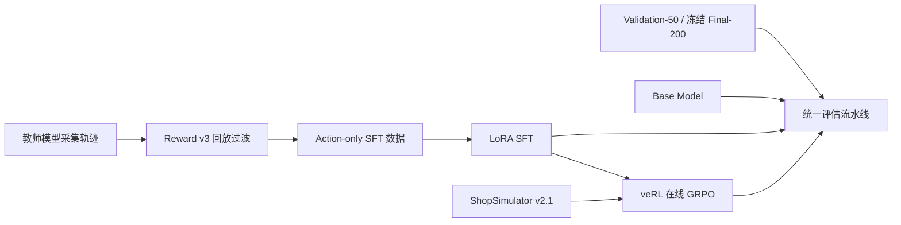
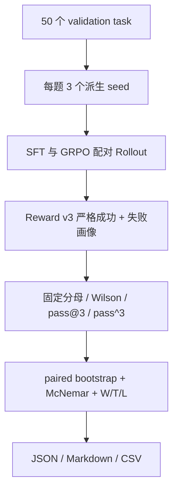

# Shopping GRPO

<div align="center">

**简体中文** · [English](README.en.md)

<br />

面向长程购物 Agent 的可复现后训练与评测项目

<br />

[](pyproject.toml)
[](docs/sft.md)
[](https://github.com/verl-project/verl)
[](https://arxiv.org/pdf/2601.18225)
[](experiments/final-200/README.md)

<br />

教师轨迹与 LoRA SFT → veRL 在线 GRPO → 配对重复采样与统计检验

</div>


## 当前结果

冻结 commit、模型、配置和数据哈希后，当前分支在 Final-200 上对 SFT 与
Terminal-GRPO（30 updates）各运行了一次确定性评测。严格成功固定以全部200题为
分母；看到结果后没有调参或重跑。

| 模型 | Strict Success | Wilson 95% CI | 相对 SFT 胜/平/负 | 循环率 | Guard 拒绝率 | 平均步数 |
|---|---:|---:|---:|---:|---:|---:|
| SFT | 114/200 = 57.0% | [50.1%, 63.7%] | — | 11.5% | 28.0% | 11.34 |
| Terminal-GRPO（30 updates） | 117/200 = **58.5%** | [51.6%, 65.1%] | 9/185/6 | 11.0% | 21.5% | 11.58 |

配对差异为 **+1.5 个百分点**；10,000 次任务级 paired bootstrap 的 95% CI 为
**[-2.0, +5.0] 个百分点**，精确 McNemar `p=0.6072`。两组覆盖率均为100%，基础设施
错误和关键 footer failure 均为0。区间跨过0，因此该结果**不支持“GRPO带来可靠的
最终提升”这一强结论**。完整冻结清单、哈希、失败画像和限制见
[Final-200 实验卡](experiments/final-200/README.md)。

此前 Validation-50×3 上观察到66.7%→74.7%（+8.0pp，CI [+2.0,+14.7]pp），但该
幅度没有在 Final-200 上复现。开发集结果保留为消融现象，不再作为最终算法结论。

## 本分支核心改造与结果归属

| 改造 | 实现 |
|---|---|
| 重复采样协议 | task/attempt 派生 seed、固定分母、可断点续跑；本地 seed replay 10/10 完全一致 |
| 统计检验 | Wilson CI、`pass@k` / `pass^k`、任务级 paired bootstrap、精确 McNemar、win/tie/loss |
| 分层诊断 | 仅从 Query 构造约束数、规格、价格和参考长度分层，不读取 Gold 商品字段 |
| 失败审计 | 基础设施、Reward 有效性、Guard、footer、循环、终止类型和上下文错误分别统计 |
| Final 冻结 | commit、模型、checkpoint、配置、开发集报告和Final-200数据哈希全部预冻结；结果只运行一次 |
| 可复现性 | JSON/Markdown/CSV 自动报告，模型/数据/配置 SHA-256，训练 seed 与显式 checkpoint resume |

本仓库由 [YYHDBL/shopping-grpo-longhorizon](https://github.com/YYHDBL/shopping-grpo-longhorizon)
的提交历史继续开发。上游导入的 200 题结果、训练耗时和显存数据在下文单独标注，不能
作为当前分支的新实验结果。仓库导入时未包含许可证文件；重新发布或用于作品集前，请
阅读 [NOTICE](NOTICE.md) 并确认上游授权条件。

## ShopSimulator 是什么？

[ShopSimulator](https://arxiv.org/pdf/2601.18225) 是一个用于评估长程购物
Agent 的大规模中文购物环境。每个任务会给出一段用户需求，其中可能包含商品类别、
预算、品牌、型号、核心功能以及颜色、尺寸、容量、套餐等具体规格。

Agent 不能只生成一句“推荐购买某商品”，而是必须真正与环境交互：

1. 根据需求搜索商品；
2. 打开并比较候选商品；
3. 查看描述、参数和可选规格；
4. 选择正确的商品变体；
5. 购买满足约束的商品，或者在证据充分时合理终止。

这类任务同时考察指令理解、工具调用、长上下文管理、约束满足和终止决策。项目内嵌
了冻结的 ShopSimulator Environment v2.1 源码和商品数据，位于
[`environments/ShopSimulator/`](environments/ShopSimulator/)，不需要用户再单独
克隆或修改一份环境仓库。


## 项目做了什么？

项目按照一条连续的后训练流水线组织：



| 阶段 | 目标 | 入口 | 详细文档 |
|---|---|---|---|
| Baseline | 测量原始 Qwen3.5-2B 的工具使用能力 | `bash scripts/baseline.sh` | [评估](docs/evaluation.md) |
| SFT | 从高质量教师轨迹学习合法、完整的购物行为 | `bash scripts/sft.sh` | [SFT](docs/sft.md) |
| GRPO | 在真实环境 Rollout 中优化 Reward v3 | `bash scripts/grpo.sh` | [GRPO](docs/grpo.md) |
| Evaluation | 开发集重复采样与冻结 Final-200 使用同一严格成功定义 | `bash scripts/evaluate.sh NAME` | [评估](docs/evaluation.md) |

### SFT 数据是怎么收集的？

最终数据使用 `deepseek-v4-flash` 作为教师模型，在 ShopSimulator
Environment v2.1 中分七批采集：

- 共获得 604 条互不重复的原始任务轨迹；
- 每条轨迹在采集时都真实执行环境动作，再按 Reward v3 终局结果验收；
- 只保留成功完成 `gold_purchase` 的 428 条轨迹；
- 删除教师模型的私有推理内容，只保留用户可观察到的工具调用与动作；
- 最终划分为 379 条训练数据和 49 条验证数据。

仓库已提供可断点续跑的采集入口：

```bash
python scripts/collect_sft_data.py \
  --tasks data/grpo/train.jsonl \
  --output-dir outputs/sft-collection \
  --target-accepted 428 \
  --workers 4
```

SFT 只在 Assistant 动作 token 上计算 Loss，用户指令和环境 Observation 会被
Mask。这样模型学习的是可执行的工具策略，而不是背诵环境返回内容。数据哈希、接受率
和采集审计见[数据采集文档](docs/data-collection.md)。

### GRPO 是怎么训练的？

GRPO 从合并后的 SFT 模型开始。veRL 在 ShopSimulator 中为每个 Prompt 在线生成
四条轨迹，环境用确定性的 Reward v3 评估最终购买结果、约束满足程度和终止行为。
训练不使用额外的 LLM-as-a-Judge Reward Model。

本仓库没有复制 veRL 源码，而是固定安装 `verl==0.8.0`，并保留项目自己的
AgentLoop、工具适配层、运行时兼容代码和一个带 SHA-256 校验的小补丁。详细配置见
[GRPO 文档](docs/grpo.md)。

### 评估流水线是怎么设计的？

当前分支的主评测入口直接回放 Actor 在 ShopSimulator 中的真实交互，并使用确定性的
Reward v3 判断终局。严格成功只接受完整的 `gold_purchase` 且
`reward_valid=true`；缺失、报错、Guard 拒绝和基础设施异常都保留在固定分母中。



约束数、规格选择、价格与参考长度分层只读取公开 Query/metadata，不使用 Gold ASIN
或目标商品字段。搜索步数与轨迹长度桶属于模型条件行为诊断，不解释为因果效应。

仓库还保留了上游 Rubric Curator 和 Trajectory Judge 的离线模块及静态 Dashboard，
但当前公开入口没有一键重跑完整 Judge 流水线，因此它们不作为本分支新结果的证据。
输入隔离规则和上游协议见[评估文档](docs/evaluation.md)。

## 上游报告的实验结果

三个模型在相同的 200 道留出任务上各进行一次确定性 Rollout：

| 模型 | 严格成功率 | 购买成功率 | 平均 Reward |
|---|---:|---:|---:|
| Qwen3.5-2B Baseline | 0.0% | 0.0% | -0.1105 |
| LoRA SFT | 60.5% | 60.5% | 0.4729 |
| GRPO step 100 | 62.0% | 62.5% | 0.5158 |

SFT 带来了主要能力提升，让模型学会合法工具调用、长程搜索和正确终止；GRPO 在此
基础上进一步减少错误购买、循环和非法动作。机器可读的训练配置、结果摘要和限制说明
位于 [`experiments/`](experiments/)。

这里的 GRPO 相对 SFT 只增加 3/200 个严格成功任务（+1.5 个百分点），而且每题仅
运行一次，因此不能据此宣称提升具有统计显著性。新增的重复采样评测支持固定尝试数、
Wilson 95% 区间、经验 `pass@k` / `pass^k`、任务级配对 Bootstrap 和精确 McNemar
检验。当前分支使用不同的SFT/30-update checkpoint和运行代码重新冻结 Final-200，
同样只得到+1.5pp，且配对区间跨0。两次Final表格的checkpoint与代码快照不同，不能
把绝对成功率变化解释为算法提升。

## 上游报告的训练硬件与耗时

上游记录中的训练均使用单张 NVIDIA RTX 6000（96 GB）完成；当前分支尚未重新测量。

### SFT LoRA 训练（379 条训练数据，3 个 epoch）

| 阶段 | 耗时 | 峰值显存 |
|---|---:|---:|
| 单个 epoch（47 步） | ~62 分钟 | 89 GiB |
| 完整 3 个 epoch | ~3 小时 | 89 GiB |

### GRPO 训练（veRL 0.8，8 个环境 worker）

| 步数范围 | 单步耗时 | 累计耗时 |
|---|---:|---:|
| step 0–24 | ~140 秒/步（含 Ray 启动开销） | ~56 分钟 |
| step 20–30 稳定后 | ~73–120 秒/步 | ~2 分钟/步稳定态 |
| 100 步（报告 checkpoint） | ~110 秒/步均值 | ~3–4 小时 |
| 完整 500 步 | ~100 秒/步 | ~14 小时 |

### 其他环节

| 环节 | 耗时估算 |
|---|---:|
| Teacher 采集（604 条 × 7 批） | ~7–14 小时 |
| 200 任务评测（Base） | ~20 分钟 |
| 200 任务评测（SFT/GRPO） | ~40–60 分钟 |
| LLM Judge 评分 200 条轨迹 | ~30–60 分钟 |

## 环境要求

- Linux；
- NVIDIA GPU 和兼容的 CUDA Driver；
- [`uv`](https://docs.astral.sh/uv/)；
- 大约 25 GB 可用磁盘空间，用于依赖、模型权重和运行产物；
- 当前 SFT 配方实测峰值为 89 GiB，按 96 GB GPU 准备；尚未验证 48 GB 配置；
- GRPO 配置按照单张 96 GB GPU 验证。

主训练环境使用 Python 3.12，ShopSimulator 使用隔离的 Python 3.10 环境。
`scripts/setup.sh` 会通过 `uv` 创建并安装两套环境。

## 快速开始

以下命令都在仓库根目录执行。

### 1. 安装

```bash
bash scripts/setup.sh
```

该脚本会安装固定版本的 SFT、veRL 和 vLLM 依赖，创建独立的 ShopSimulator
环境，校验并解压商品数据，构建搜索索引，并应用经过版本和哈希检查的 veRL 补丁。

### 2. 启动 ShopSimulator

在第一个终端运行并保持服务：

```bash
bash scripts/start_environment.sh
```

服务默认监听 `http://127.0.0.1:5700`。

### 3. 运行 Baseline

在第二个终端启动基础模型：

```bash
bash scripts/serve_model.sh Qwen/Qwen3.5-2B
```

在第三个终端评估：

```bash
bash scripts/baseline.sh
```

开始训练前请停止模型服务，释放 GPU 显存。

### 4. 训练并评估 SFT

```bash
bash scripts/sft.sh
bash scripts/serve_model.sh outputs/models/sft-merged
bash scripts/evaluate.sh sft
```

完成评估后再次停止模型服务。

### 5. 训练 GRPO

先只解析并打印最终命令，不启动 CUDA 或 Ray：

```bash
bash scripts/grpo.sh --dry-run
```

开始训练：

```bash
bash scripts/grpo.sh
```

根据验证集指标选择 Checkpoint，并导出 veRL Actor：

```bash
bash scripts/export_grpo.sh \
  outputs/models/grpo/global_step_100/actor \
  outputs/models/grpo-merged
```

该脚本会先还原 veRL FSDP 权重，再将 GRPO LoRA 真正合并进主模型。最终目录是可直接
服务的独立模型；若只服务 veRL 生成的中间主权重、忽略其 `lora_adapter/`，实际评测的
会是未应用 GRPO 更新的起始模型。

启动并评估导出的模型：

```bash
bash scripts/serve_model.sh outputs/models/grpo-merged
bash scripts/evaluate.sh grpo
```

Checkpoint、Rollout 和日志统一写入 Git 忽略的 `outputs/`。

### 6. 生成配对统计报告

SFT 和 GRPO 的重复轨迹采集命令见 [GPU Runbook](docs/gpu-runbook.md)。两组 JSONL
准备完成后，使用同一个入口生成机器可读结果和展示表格：

```bash
python scripts/compare_repeated_evaluations.py \
  --benchmark data/grpo/validation.jsonl --limit 50 \
  --baseline outputs/eval/sft-50x3/raw.jsonl \
  --candidate outputs/eval/terminal-grpo-50x3/raw.jsonl \
  --attempts-per-task 3 --bootstrap-samples 10000 --seed 2026 \
  --baseline-label SFT --candidate-label Terminal-GRPO \
  --output outputs/eval/sft-vs-terminal-50x3/comparison.json \
  --markdown-output outputs/eval/sft-vs-terminal-50x3/report.md \
  --csv-output outputs/eval/sft-vs-terminal-50x3/report.csv
```

## Reward v3 简介

Reward v3 是一个确定性的终局 Reward，不依赖另一个大模型进行主观判断：

- 类别和预算是 Hard Gate；
- 品牌、型号、核心功能、关键规格按照 `0.35 / 0.25 / 0.25 / 0.15` 加权；
- 完全满足并命中目标商品得到 `1.0`；
- 完全满足的替代商品得到 `0.55`；
- 部分满足按照连续分数计算，最高 `0.25`；
- 错误购买、过早放弃、重复循环和达到最大步数都会获得不同负奖励；
- 证据不足时标记为 `reward_valid=false`，不会伪装成有效的零分样本。


完整公式、终止条件和证据要求见 [Reward v3 设计文档](docs/reward-v3.md)。

重复采样、难度分层和配对统计的定义见[统计评测升级](docs/local-upgrades.md)；租卡后的
SFT-vs-GRPO 执行命令、停机条件和产物清单见 [96 GB GPU Runbook](docs/gpu-runbook.md)。

## 仓库结构

```text
configs/                         当前 GRPO、AgentLoop 和工具配置
data/
  sft/                           379 条训练 + 49 条验证轨迹
  grpo/                          JSONL 与 veRL Parquet 数据
  evaluation/                    冻结的 200 道留出任务
docs/                            数据、SFT、GRPO、评估与 Reward 文档
environments/ShopSimulator/      内嵌环境源码和商品数据
experiments/
  final-200/                      当前分支冻结终测结果与哈希
  validation-50x3/               当前分支 50×3 配对评测卡与哈希
  baseline/                      Baseline 配置与结果
  sft/                           SFT 配置与结果
  grpo/                          GRPO 配置与结果
scripts/                         面向用户的薄入口脚本
src/shopping_grpo/
  collection/                    Teacher 轨迹验收与 SFT 数据构造
  environment/                   环境客户端、动作、工具和 Observation
  training/sft/                  SFT 数据渲染与 Mask
  training/grpo/                 veRL AgentLoop、适配和动态采样
  evaluation/                    重复采样、配对统计、分层诊断与上游 Judge 模块
tests/                           核心单元、入口和 Wheel 安装检查
```

## 常用配置

| 环境变量 | 默认值 |
|---|---|
| `BASE_MODEL` | `Qwen/Qwen3.5-2B` |
| `SHOPSIM_BASE_URL` | `http://127.0.0.1:5700` |
| `LLM_BASE_URL` | `http://127.0.0.1:8000/v1` |
| `SERVED_MODEL_NAME` | `shopping-agent` |
| `SFT_ADAPTER_DIR` | `outputs/models/sft-lora` |
| `SFT_MERGED_DIR` | `outputs/models/sft-merged` |

GRPO 的高级 Hydra 参数可以追加在 `--` 后：

```bash
bash scripts/grpo.sh -- \
  trainer.total_training_steps=20 \
  trainer.save_freq=10
```

SwanLab 默认关闭，需要时显式启用：

```bash
export SWANLAB_API_KEY=...
bash scripts/grpo.sh --logger swanlab
```

## 文档导航

- [数据采集与数据来源](docs/data-collection.md)
- [LoRA SFT](docs/sft.md)
- [使用 veRL 进行 GRPO](docs/grpo.md)
- [留出集评估](docs/evaluation.md)
- [统计评测升级](docs/local-upgrades.md)
- [50×3 GPU 执行手册](docs/gpu-runbook.md)
- [当前 Validation-50×3 实验卡](experiments/validation-50x3/README.md)
- [当前冻结 Final-200 实验卡](experiments/final-200/README.md)
- [Final-200 Benchmark Dashboard](docs/evaluation-dashboard.html)
- [Reward v3 设计](docs/reward-v3.md)
- [可审计实验结果](experiments/comparison.md)

## 引用与致谢

本仓库首先是
[YYHDBL/shopping-grpo-longhorizon](https://github.com/YYHDBL/shopping-grpo-longhorizon)
的二次开发，并建立在
[ShopSimulator 论文](https://arxiv.org/pdf/2601.18225)及其开源环境、
[veRL](https://github.com/verl-project/verl) 和
[Qwen](https://github.com/QwenLM/Qwen3) 之上。

评测协议和 Benchmark 构建还参考了
[VitaBench: Benchmarking LLM Agents with Versatile Interactive Tasks in Real-world Applications](https://arxiv.org/pdf/2509.26490)
以及
[EComAgentBench: Benchmarking Shopping Agents on Long-Horizon Tasks with Distributed Hidden Intent](https://arxiv.org/pdf/2606.17698)。

仓库结构和教程呈现参考了
[qiqihezh/agentic-grpo-longhorizon](https://github.com/qiqihezh/agentic-grpo-longhorizon)。
感谢 [OpenCode Go 套餐](https://dev.opencode.ai/go) 对开发工作的支持。
