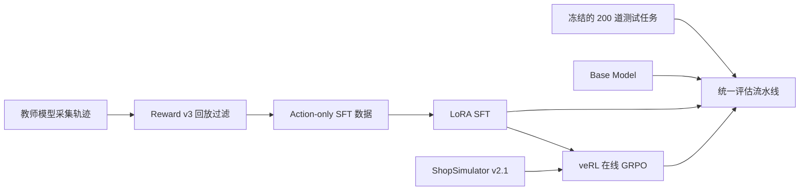
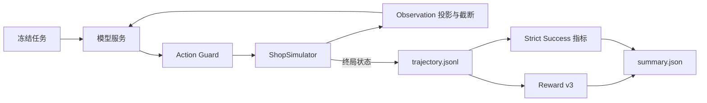

# Shopping GRPO

<div align="center">

**简体中文** · [English](README.en.md)

面向初学者的 Shopping Agent 完整后训练教程

`Qwen3.5-2B Baseline → LoRA SFT → veRL GRPO → 统一评估`

</div>

这个仓库只保留一条当前可用的主线：克隆项目、准备环境，然后依次完成
Baseline、SFT、GRPO 和 Evaluation。ShopSimulator 环境、冻结数据集、veRL
适配代码、训练配置和评估入口都已经放在仓库中，初学者不需要从历史实验或旧版本中
猜测“应该运行哪一套”。

## ShopSimulator 是什么？

[ShopSimulator](https://arxiv.org/pdf/2601.18225) 是一个用于评估长程购物
Agent 的大规模中文购物环境。每个任务会给出一段用户需求，其中可能包含商品类别、
预算、品牌、型号、核心功能以及颜色、尺寸、容量、套餐等具体规格。

Agent 不能只生成一句“推荐购买某商品”，而是必须真正与环境交互：

1. 根据需求搜索商品；
2. 打开并比较候选商品；
3. 查看描述、参数和可选规格；
4. 选择正确的商品变体；
5. 购买满足约束的商品，或者在证据充分时合理终止。

这类任务同时考察指令理解、工具调用、长上下文管理、约束满足和终止决策。项目内嵌
了冻结的 ShopSimulator Environment v2.1 源码和商品数据，位于
[`environments/ShopSimulator/`](environments/ShopSimulator/)，不需要用户再单独
克隆或修改一份环境仓库。

> **图片预留 1｜环境概览图。** 左侧展示一条包含预算、品牌和规格要求的中文购物
> 指令；中间展示 Agent 的“搜索 → 查看 → 对比 → 选择规格 → 购买”交互；右侧展示
> ShopSimulator 商品库、环境状态与终局 Reward。

## 项目做了什么？

项目按照一条连续的后训练流水线组织：



| 阶段 | 目标 | 入口 | 详细文档 |
|---|---|---|---|
| Baseline | 测量原始 Qwen3.5-2B 的工具使用能力 | `bash scripts/baseline.sh` | [评估](docs/evaluation.md) |
| SFT | 从高质量教师轨迹学习合法、完整的购物行为 | `bash scripts/sft.sh` | [SFT](docs/sft.md) |
| GRPO | 在真实环境 Rollout 中优化 Reward v3 | `bash scripts/grpo.sh` | [GRPO](docs/grpo.md) |
| Evaluation | 使用同一批 200 道留出任务公平比较三个模型 | `bash scripts/evaluate.sh NAME` | [评估](docs/evaluation.md) |

### SFT 数据是怎么收集的？

最终数据使用 `deepseek-v4-flash` 作为教师模型，在 ShopSimulator
Environment v2.1 中分七批采集：

- 共获得 604 条互不重复的原始任务轨迹；
- 使用 Reward v3 对轨迹进行环境回放和终局检查；
- 只保留成功完成 `gold_purchase` 的 428 条轨迹；
- 删除教师模型的私有推理内容，只保留用户可观察到的工具调用与动作；
- 最终划分为 379 条训练数据和 49 条验证数据。

SFT 只在 Assistant 动作 token 上计算 Loss，用户指令和环境 Observation 会被
Mask。这样模型学习的是可执行的工具策略，而不是背诵环境返回内容。数据哈希、接受率
和采集审计见[数据采集文档](docs/data-collection.md)。

### GRPO 是怎么训练的？

GRPO 从合并后的 SFT 模型开始。veRL 在 ShopSimulator 中为每个 Prompt 在线生成
四条轨迹，环境用确定性的 Reward v3 评估最终购买结果、约束满足程度和终止行为。
训练不使用额外的 LLM-as-a-Judge Reward Model。

本仓库没有复制 veRL 源码，而是固定安装 `verl==0.8.0`，并保留项目自己的
AgentLoop、工具适配层、运行时兼容代码和一个带 SHA-256 校验的小补丁。详细配置见
[GRPO 文档](docs/grpo.md)。

### 评估流水线是怎么设计的？

Baseline、SFT 和 GRPO 模型都通过相同的 OpenAI-compatible 服务接口接受同一批
200 道留出任务。每道题只运行一次确定性 Rollout：



Action Guard 会阻止模型点击当前 Observation 中不存在的商品或按钮；Observation
投影负责在 24,576 token 上下文中保留关键商品证据；终局后同时计算 Reward v3、
购买成功率和严格成功率。缺失、报错或无有效终局的任务仍保留在 200 道题的分母中。
完整协议见[评估文档](docs/evaluation.md)。

> **图片预留 2｜训练与评估全流程图。** 使用横向大图串联“教师数据采集、Reward
> 过滤、LoRA SFT、在线 GRPO、模型导出、统一 200 题评估”，并在每个阶段下方标注
> 输入文件、输出产物和核心指标。

## 实验结果

三个模型在相同的 200 道留出任务上各进行一次确定性 Rollout：

| 模型 | 严格成功率 | 购买成功率 | 平均 Reward |
|---|---:|---:|---:|
| Qwen3.5-2B Baseline | 0.0% | 0.0% | -0.1105 |
| LoRA SFT | 60.5% | 60.5% | 0.4729 |
| GRPO step 100 | 62.0% | 62.5% | 0.5158 |

SFT 带来了主要能力提升，让模型学会合法工具调用、长程搜索和正确终止；GRPO 在此
基础上进一步减少错误购买、循环和非法动作。机器可读的训练配置、结果摘要和限制说明
位于 [`experiments/`](experiments/)。

## 训练硬件、耗时与成本

以下是本项目训练时使用的单卡配置。成本为端到端约数，后续可以根据最终训练日志和
云服务账单调整：

| 阶段 | 使用硬件 | 耗时 | 估算成本 |
|---|---|---:|---:|
| SFT | RTX 4090 48 GB | 待根据最终日志填写 | 计入总成本 |
| GRPO | RTX 6000 96 GB | 待根据最终日志填写 | 计入总成本 |
| 完整流程 | 教师 API + GPU 训练与评估 | 取决于机器和服务商 | 约 50 美元 |

这里的 4090 是 48 GB 显存配置，并非标准零售版 24 GB。RTX 6000 的具体型号、
各阶段墙钟时间和费用拆分暂时保留为可调整项，避免在核对日志前给出虚假的精确数字。

> **图片预留 3｜训练时间与成本图。** 用一条时间轴展示数据采集、SFT、GRPO 和
> Final-200 Evaluation；每个阶段标注 GPU 型号、显存、墙钟时间、API/GPU 成本，
> 右侧汇总总成本约 50 美元。

## 环境要求

- Linux；
- NVIDIA GPU 和兼容的 CUDA Driver；
- [`uv`](https://docs.astral.sh/uv/)；
- 大约 25 GB 可用磁盘空间，用于依赖、模型权重和运行产物；
- SFT 配置按照 48 GB 显存设计；
- GRPO 配置按照单张 96 GB GPU 验证。

主训练环境使用 Python 3.12，ShopSimulator 使用隔离的 Python 3.10 环境。
`scripts/setup.sh` 会通过 `uv` 创建并安装两套环境。

## 快速开始

以下命令都在仓库根目录执行。

### 1. 安装

```bash
bash scripts/setup.sh
```

该脚本会安装固定版本的 SFT、veRL 和 vLLM 依赖，创建独立的 ShopSimulator
环境，校验并解压商品数据，构建搜索索引，并应用经过版本和哈希检查的 veRL 补丁。

### 2. 启动 ShopSimulator

在第一个终端运行并保持服务：

```bash
bash scripts/start_environment.sh
```

服务默认监听 `http://127.0.0.1:5700`。

### 3. 运行 Baseline

在第二个终端启动基础模型：

```bash
bash scripts/serve_model.sh Qwen/Qwen3.5-2B
```

在第三个终端评估：

```bash
bash scripts/baseline.sh
```

开始训练前请停止模型服务，释放 GPU 显存。

### 4. 训练并评估 SFT

```bash
bash scripts/sft.sh
bash scripts/serve_model.sh outputs/models/sft-merged
bash scripts/evaluate.sh sft
```

完成评估后再次停止模型服务。

### 5. 训练 GRPO

先只解析并打印最终命令，不启动 CUDA 或 Ray：

```bash
bash scripts/grpo.sh --dry-run
```

开始训练：

```bash
bash scripts/grpo.sh
```

根据验证集指标选择 Checkpoint，并导出 veRL Actor：

```bash
bash scripts/export_grpo.sh \
  outputs/models/grpo/global_step_100/actor \
  outputs/models/grpo-merged
```

启动并评估导出的模型：

```bash
bash scripts/serve_model.sh outputs/models/grpo-merged
bash scripts/evaluate.sh grpo
```

Checkpoint、Rollout 和日志统一写入 Git 忽略的 `outputs/`。

## Reward v3 简介

Reward v3 是一个确定性的终局 Reward，不依赖另一个大模型进行主观判断：

- 类别和预算是 Hard Gate；
- 品牌、型号、核心功能、关键规格按照 `0.35 / 0.25 / 0.25 / 0.15` 加权；
- 完全满足并命中目标商品得到 `1.0`；
- 完全满足的替代商品得到 `0.55`；
- 部分满足按照连续分数计算，最高 `0.25`；
- 错误购买、过早放弃、重复循环和达到最大步数都会获得不同负奖励；
- 证据不足时标记为 `reward_valid=false`，不会伪装成有效的零分样本。

完整公式、终止条件和证据要求见 [Reward v3 设计文档](docs/reward-v3.md)。

## 仓库结构

```text
configs/                         当前 GRPO、AgentLoop 和工具配置
data/
  sft/                           379 条训练 + 49 条验证轨迹
  grpo/                          JSONL 与 veRL Parquet 数据
  evaluation/                    冻结的 200 道留出任务
docs/                            数据、SFT、GRPO、评估与 Reward 文档
environments/ShopSimulator/      内嵌环境源码和商品数据
experiments/
  baseline/                      Baseline 配置与结果
  sft/                           SFT 配置与结果
  grpo/                          GRPO 配置与结果
scripts/                         面向用户的薄入口脚本
src/shopping_grpo/
  environment/                   环境客户端、动作、工具和 Observation
  training/sft/                  SFT 数据渲染与 Mask
  training/grpo/                 veRL AgentLoop、适配和动态采样
  evaluation/                    Rollout、轨迹规范化和指标汇总
tests/                           核心单元、入口和 Wheel 安装检查
```

## 常用配置

| 环境变量 | 默认值 |
|---|---|
| `BASE_MODEL` | `Qwen/Qwen3.5-2B` |
| `SHOPSIM_BASE_URL` | `http://127.0.0.1:5700` |
| `LLM_BASE_URL` | `http://127.0.0.1:8000/v1` |
| `SERVED_MODEL_NAME` | `shopping-agent` |
| `SFT_ADAPTER_DIR` | `outputs/models/sft-lora` |
| `SFT_MERGED_DIR` | `outputs/models/sft-merged` |

GRPO 的高级 Hydra 参数可以追加在 `--` 后：

```bash
bash scripts/grpo.sh -- \
  trainer.total_training_steps=20 \
  trainer.save_freq=10
```

SwanLab 默认关闭，需要时显式启用：

```bash
export SWANLAB_API_KEY=...
bash scripts/grpo.sh --logger swanlab
```

## 文档导航

- [数据采集与数据来源](docs/data-collection.md)
- [LoRA SFT](docs/sft.md)
- [使用 veRL 进行 GRPO](docs/grpo.md)
- [留出集评估](docs/evaluation.md)
- [Reward v3 设计](docs/reward-v3.md)
- [可审计实验结果](experiments/comparison.md)

## 引用与致谢

本项目建立在
[ShopSimulator 论文](https://arxiv.org/pdf/2601.18225)及其开源环境、
[veRL](https://github.com/verl-project/verl) 和
[Qwen](https://github.com/QwenLM/Qwen3) 之上。

仓库结构和教程呈现参考了
[qiqihezh/agentic-grpo-longhorizon](https://github.com/qiqihezh/agentic-grpo-longhorizon)。
感谢 [OpenCode Go 套餐](https://dev.opencode.ai/go) 对开发工作的支持。
